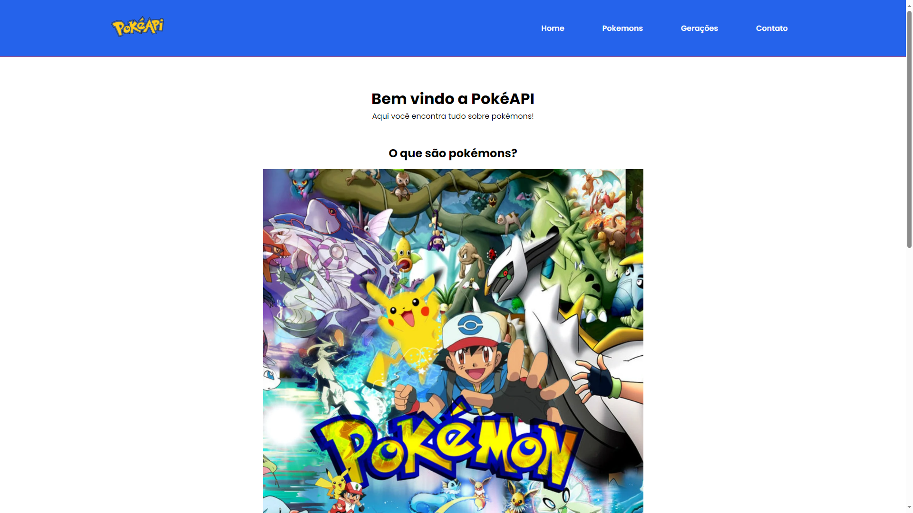

<h1 align="center"> React Movies </h1>

<p align="center">
  Bem-vindo ao projeto React Movies!<br/>
</p>

<p align="center">
  <a href="#-tecnologias">Tecnologias</a>&nbsp;&nbsp;&nbsp;|&nbsp;&nbsp;&nbsp;
    <a href="#-instalacao-do-projeto">Instalação do projeto</a>&nbsp;&nbsp;&nbsp;|&nbsp;&nbsp;&nbsp;
  <a href="#-sobre-o-projeto">Sobre o Projeto</a>&nbsp;&nbsp;&nbsp;

</p>

<p align="center">
  
</p>

## 🚀 Tecnologias <br id="-tecnologias">

Esse projeto foi desenvolvido com as seguintes tecnologias:

- Typescript
- Angular 17
- SCSS
- API's (pokeAPI)

## ⚙️ Instalação do projeto <br id="-instalacao-do-projeto">

### Passo-a-passo:

#### 1. Clone o repositório para o seu computador usando o seguinte comando:

```bash
git clone git@github.com:andr3felipe/vemser-angular.git
```

#### 2. Navegue até o diretório do projeto:

```bash
cd vemser-angular
```

#### 3. Instale as dependências do projeto:

```bash
npm install
# or
yarn
```

#### 3. Inicie um servidor de desenvolvimento:

```bash
npm ng serve
# or
yarn ng serve
```

## 💻 Sobre o Projeto <br id="-sobre-o-projeto">

Utilizei a pokeAPI pra fazer está aplicação com o tema de pokémon:

- Página inícial com introdução a história do Pokémon;
- Página de Pokemons, aqui você encontra todos os pokémons;
- Página de Gerações, aqui você encontra os pokémons de cada geração e mais informações como, principais regiões, tipos de pokémons;
- Rota dinámica com mais informações especificas de um pokémon.
